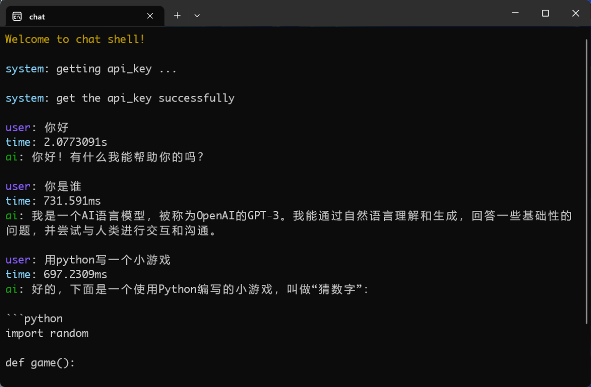

# 基于Openai ChatGPT的终端GPT


## 简介

本项目是基于Openai ChatGPT开发的终端版本GPT。使用go语言开发，目的是为了能够编译成exe，方便快速访问。

## 效果 


## 启动说明

### 将config_dev目录名称改为config
```shell
mv config_dev config
```

### 修改config/config.go里面的配置内容
```shell
cd config
vim config.go // 或使用其它编辑器修改config.go里面的内容
```

### 运行方式
#### 1. 直接运行
```shell
go run main.go
```

#### 2. 编译后添加快捷方式运行
##### 编译代码
先编译代码为可执行文件。
```shell
go build main.go
```

使用上面命令编译完后，会在项目目录下生成一个`main.exe`文件。此时双击即可运行

##### 添加快捷方式
在资源管理器中找到该文件，右键生成创建快捷方式。

在快捷方式文件右键，选择属性-->更换图标-->浏览-->选择ico文件 进行更换图标。

可以将快捷方式拖拽到任务栏，方便快速打开使用。
